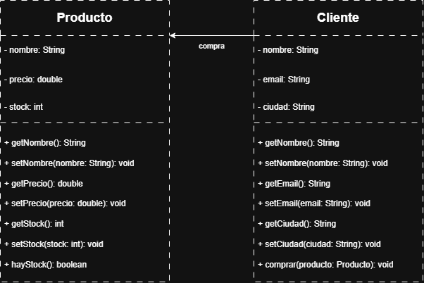
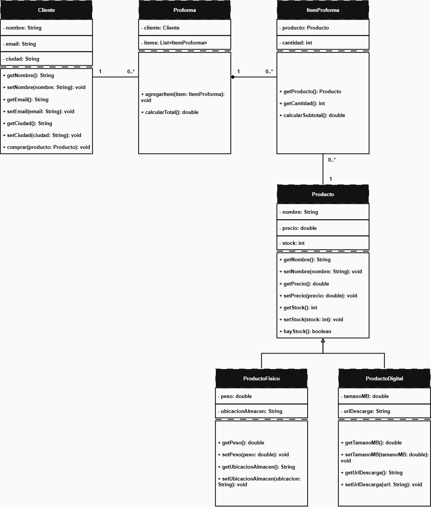

# UEES - Programación Orientada a Objetos - Python

Proyecto desarrollado como parte de la asignatura de Programación Orientada a Objetos.

El sistema modela una empresa proveedora de tecnología y capacitación que puede atender tanto a personas naturales bajo un modelo B2C como a empresas bajo un modelo B2B.

## Objetivo

Aplicar los fundamentos de Programación Orientada a Objetos mediante el modelado de clientes, productos y proformas utilizando encapsulación, asociación, herencia, composición, abstracción y polimorfismo.

---

## Semana 1 - Encapsulación y asociación

Durante la Semana 1 se implementaron las clases:

- `Producto`
- `Cliente`

### Conceptos aplicados

- Clases y objetos
- Encapsulación
- Propiedades
- Getters y setters mediante `@property`
- Asociación entre objetos

La clase `Producto` representa los artículos o servicios comercializados por la empresa.

La clase `Cliente` representa al comprador del sistema.

---

## Semana 2 - Herencia y composición

Durante la Semana 2 se amplió el modelo incorporando herencia y composición.

### Herencia

La clase `Producto` funciona como clase base para:

- `ProductoFisico`
- `ProductoDigital`

`ProductoFisico` incorpora:

- peso
- ubicación de almacenamiento

`ProductoDigital` incorpora:

- tamaño en MB
- URL de descarga

### Composición

La clase `Proforma` contiene una colección de objetos `ItemProforma`.

Cada `ItemProforma` relaciona:

- un producto
- una cantidad
- el cálculo del subtotal

---

## Semana 3 - Polimorfismo, interfaces y clases abstractas

Durante la Semana 3 se incorporaron abstracción, métodos abstractos, especialización de clientes y polimorfismo.

### Clase abstracta Cliente

Python utiliza el módulo estándar `abc`.

La clase `Cliente` hereda de `ABC`:

```python
from abc import ABC, abstractmethod

class Cliente(ABC):
```

y define el método:

```python
@abstractmethod
def calcular_descuento(self) -> float:
    pass
```

Esto impide crear directamente objetos de tipo `Cliente` y obliga a las subclases concretas a proporcionar una implementación de `calcular_descuento()`.

### ClienteMayorista

```python
class ClienteMayorista(Cliente):
    def calcular_descuento(self) -> float:
        return 0.20
```

El descuento aplicado es del **20 %**.

### ClienteMinorista

```python
class ClienteMinorista(Cliente):
    def calcular_descuento(self) -> float:
        return 0.05
```

El descuento aplicado es del **5 %**.

### Polimorfismo

La clase `Proforma` mantiene una referencia de tipo:

```python
Cliente
```

y obtiene el descuento mediante:

```python
descuento = self._cliente.calcular_descuento()
```

Posteriormente calcula:

```python
return subtotal * (1 - descuento)
```

La misma operación produce distintos resultados dependiendo de si el objeto real es:

- `ClienteMayorista`
- `ClienteMinorista`

No es necesario utilizar estructuras `if/elif` para identificar el tipo de cliente.

El comportamiento se selecciona dinámicamente mediante polimorfismo.

### Resultados

| Tipo de cliente | Descuento | Total |
|---|---:|---:|
| ClienteMayorista | 20 % | $872.00 |
| ClienteMinorista | 5 % | $1035.50 |

---

## Clases principales

- `Cliente` — clase abstracta
- `ClienteMayorista`
- `ClienteMinorista`
- `Producto`
- `ProductoFisico`
- `ProductoDigital`
- `ItemProforma`
- `Proforma`

---

## Modelo general

```text
                    Cliente
                     <<ABC>>
                  /           \
                 /             \
                v               v
      ClienteMayorista    ClienteMinorista
              |                  |
              +--------+---------+
                       |
                       v
                    Proforma
                       |
                       v
                  ItemProforma
                       |
                       v
                    Producto
                   /        \
                  /          \
                 v            v
        ProductoFisico   ProductoDigital
```

---

# Diagramas UML

## Semana 1



## Semana 2



## Semana 3

El modelo actualizado incorpora:

- `Cliente` como clase abstracta
- `ClienteMayorista`
- `ClienteMinorista`
- `calcular_descuento()`
- herencia
- composición
- polimorfismo

El diagrama UML correspondiente a Semana 3 será incorporado junto con las evidencias finales.

---

# Ejecución

## Windows

Desde la raíz del repositorio:

```powershell
python -m src.main
```

## Fedora Linux

```bash
python3 -m src.main
```

---

## Ejemplo de ejecución Semana 3

```text
Producto fisico: Laptop
Peso: 2.1 kg
Ubicacion: Bodega A

Producto digital: Curso Python
Tamano: 1500.0 MB
URL: https://ejemplo.com/curso

=== PROFORMA CLIENTE MAYORISTA ===
Cliente: Sergio
Descuento: 20.0 %
Subtotal Laptop: $850.0
Subtotal Curso: $240.0
Total Proforma: $872.0

=== PROFORMA CLIENTE MINORISTA ===
Cliente: Ana
Descuento: 5.0 %
Subtotal Laptop: $850.0
Subtotal Curso: $240.0
Total Proforma: $1035.5
```

La ejecución fue comprobada tanto en Windows como en Fedora Linux.

---

## Tecnologías utilizadas

- Python
- Programación Orientada a Objetos
- Python `abc`
- Antigravity IDE
- Windows PowerShell
- Fedora Linux
- UML
- PlantUML
- diagrams.net
- Git
- GitHub

---

## Conceptos de Programación Orientada a Objetos aplicados

- Clases y objetos
- Encapsulación
- Propiedades
- Asociación
- Herencia
- Composición
- Abstracción
- Clases abstractas
- Métodos abstractos
- Sobrescritura
- Polimorfismo
- Enlace dinámico

---

## Autor

Sergio Méndez
