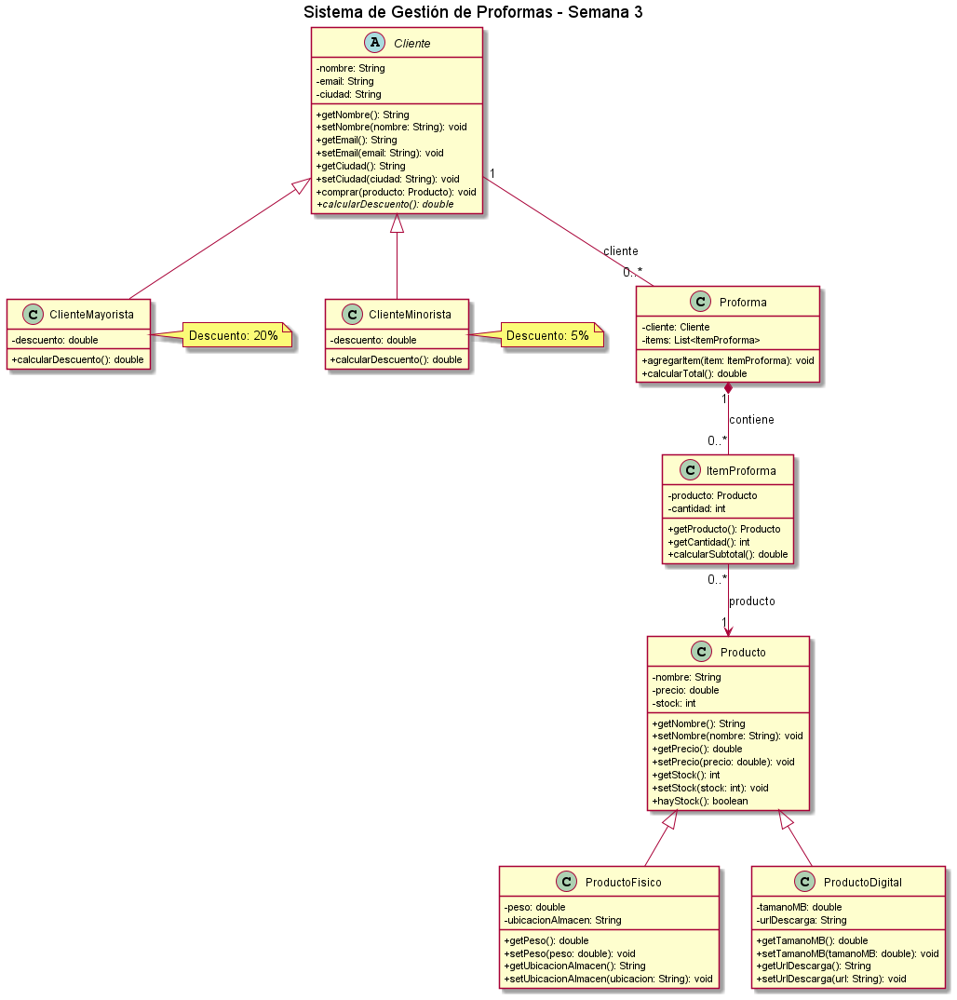
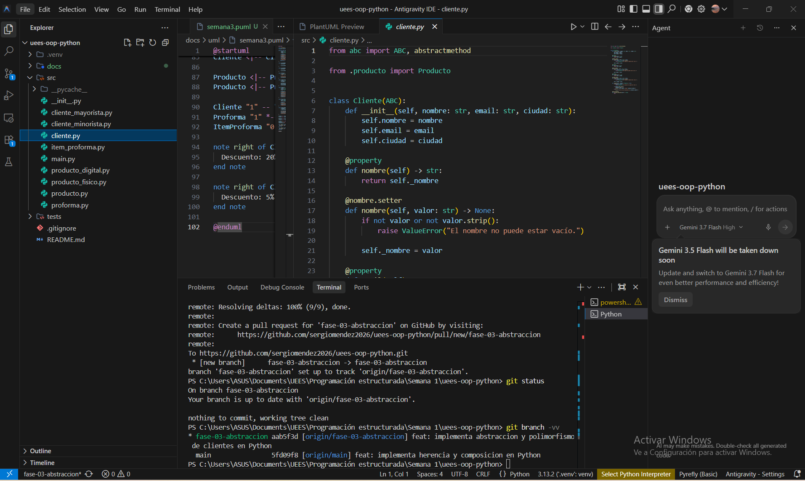
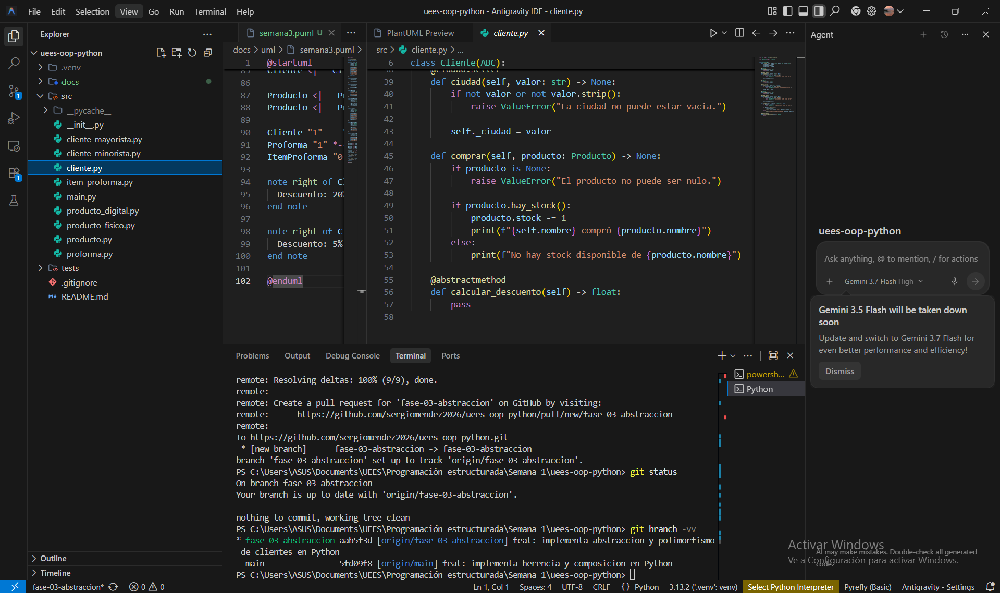
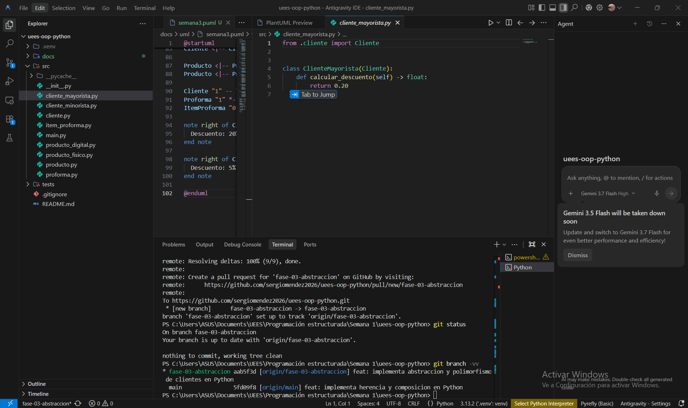
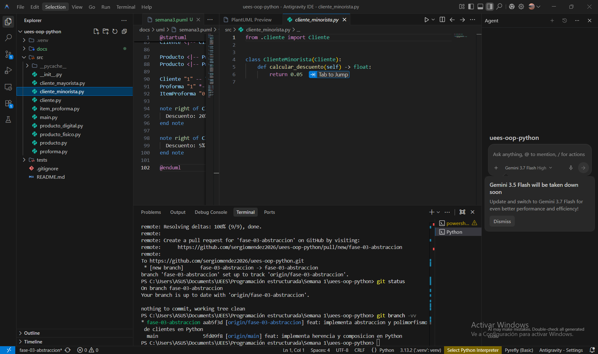
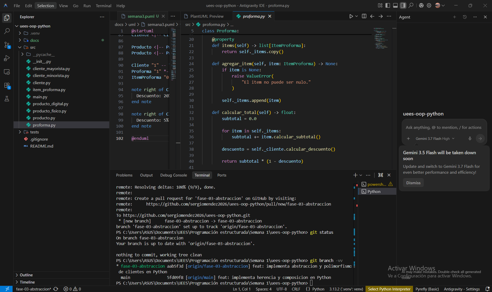
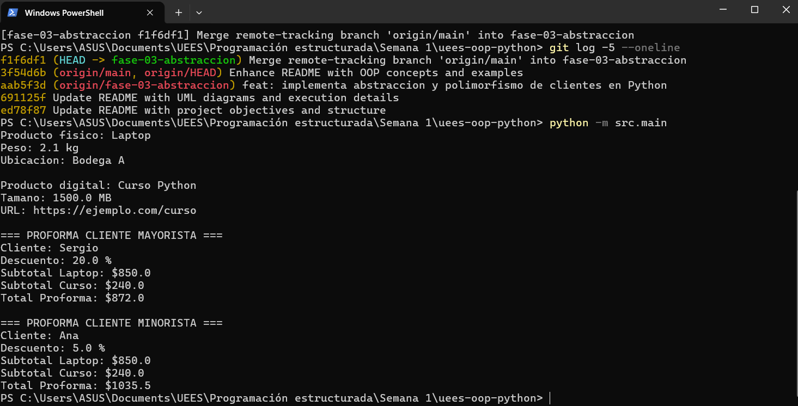
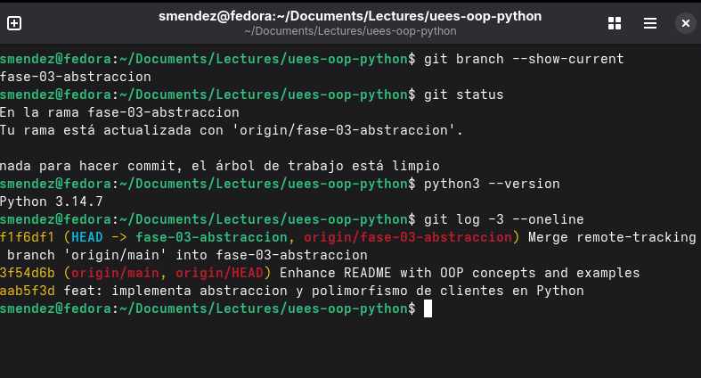
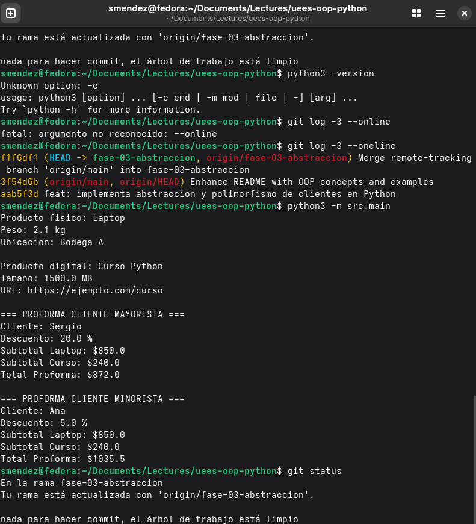

# UEES - Programación Orientada a Objetos - Python

## Descripción breve

Proyecto desarrollado como parte de la asignatura de Programación Orientada a Objetos.

El sistema modela una empresa proveedora de tecnología y capacitación que puede atender tanto a personas naturales bajo un modelo B2C como a empresas bajo un modelo B2B.

El proyecto se desarrolló incrementalmente hasta la Semana 3 y aplica conceptos fundamentales de Programación Orientada a Objetos utilizando Python.

---

## Objetivo

Aplicar los fundamentos de Programación Orientada a Objetos mediante el modelado de clientes, productos y proformas utilizando:

- clases y objetos
- encapsulación
- propiedades
- asociación
- herencia
- composición
- abstracción
- métodos abstractos
- sobrescritura
- polimorfismo

---

## Principales funcionalidades

- Gestión de clientes y productos mediante clases.
- Encapsulación y validación de atributos.
- Especialización de productos mediante herencia.
- Generación de proformas mediante composición.
- Cálculo de subtotales por producto y cantidad.
- Gestión de clientes mayoristas y minoristas.
- Aplicación de descuentos mediante abstracción y polimorfismo.
- Ejecución comprobada en Windows y Fedora Linux.

---

## Lenguaje utilizado

**Python 3**

---

## Ejecución rápida

Desde la raíz del repositorio:

### Windows

```bash
python -m src.main

Fedora Linux

python3 -m src.main

---

## Semana 1 - Encapsulación y asociación

Durante la Semana 1 se implementaron las clases principales:

- `Producto`
- `Cliente`

## Conceptos aplicados

- Clases y objetos
- Encapsulación
- Atributos protegidos mediante propiedades
- Getters y setters con `@property`
- Validación de datos
- Asociación entre objetos

La clase `Producto` representa los productos o servicios comercializados por la empresa.

La clase `Cliente` representa al comprador y contiene información como:

- nombre
- correo electrónico
- ciudad

Además, el cliente puede interactuar con objetos de tipo `Producto`.

## UML Semana 1


---

# Semana 2 - Herencia y composición

Durante la Semana 2 se amplió el modelo incorporando especialización de productos y composición mediante proformas.

## Herencia

La clase `Producto` funciona como clase base para:

- `ProductoFisico`
- `ProductoDigital`

### ProductoFisico

Agrega características específicas como:

- peso
- ubicación de almacenamiento

### ProductoDigital

Agrega características específicas como:

- tamaño en MB
- URL de descarga

La jerarquía es:

```text
Producto
   |
   +-- ProductoFisico
   |
   +-- ProductoDigital
```

## Composición

La clase `Proforma` contiene una colección de objetos `ItemProforma`.

Cada `ItemProforma` relaciona:

- un `Producto`
- una cantidad
- el cálculo del subtotal

La estructura conceptual es:

```text
Cliente
   |
   v
Proforma
   |
   v
ItemProforma
   |
   v
Producto
```

La clase `Proforma` permite agregar diferentes productos y calcular el valor total de una operación comercial.

## UML Semana 2


---

# Semana 3 - Abstracción y polimorfismo

Durante la Semana 3 se incorporaron abstracción y polimorfismo al modelo de clientes.

La clase `Cliente` se convirtió en una clase abstracta utilizando el módulo `abc` de Python.

Se agregaron dos especializaciones:

- `ClienteMayorista`
- `ClienteMinorista`

## Clase abstracta Cliente

La declaración utiliza:

```python
from abc import ABC, abstractmethod


class Cliente(ABC):
    ...
```

Esto impide que `Cliente` sea utilizado como una implementación concreta cuando todavía existen comportamientos que deben ser definidos por sus subclases.

## Método abstracto

La clase `Cliente` define:

```python
@abstractmethod
def calcular_descuento(self) -> float:
    pass
```

Cada subclase debe proporcionar su propia implementación.

## ClienteMayorista

`ClienteMayorista` sobrescribe el método:

```python
def calcular_descuento(self) -> float:
    return 0.20
```

Por lo tanto, un cliente mayorista obtiene un descuento del:

```text
20 %
```

## ClienteMinorista

`ClienteMinorista` implementa:

```python
def calcular_descuento(self) -> float:
    return 0.05
```

Por lo tanto, un cliente minorista obtiene un descuento del:

```text
5 %
```

## Polimorfismo

La clase `Proforma` trabaja con la abstracción `Cliente`:

```python
def __init__(self, cliente: Cliente) -> None:
    self._cliente = cliente
```

Cuando calcula el total ejecuta:

```python
descuento = self._cliente.calcular_descuento()
return subtotal * (1 - descuento)
```

`Proforma` no necesita conocer si el objeto recibido es un `ClienteMayorista` o un `ClienteMinorista`.

El comportamiento correcto se determina dinámicamente según el objeto utilizado en tiempo de ejecución.

Conceptualmente:

```text
                 Cliente
               <<abstract>>
                    |
          +---------+---------+
          |                   |
          v                   v
ClienteMayorista       ClienteMinorista
      |                       |
      v                       v
     20 %                    5 %
```

Esto constituye una aplicación directa de polimorfismo.

## UML Semana 3



El archivo fuente del diagrama PlantUML se encuentra en:

```text
docs/uml/uml_semana3_polimorfismo.puml
```

---

# Clases principales

Actualmente el proyecto contiene las siguientes clases:

- `Cliente`
- `ClienteMayorista`
- `ClienteMinorista`
- `Producto`
- `ProductoFisico`
- `ProductoDigital`
- `ItemProforma`
- `Proforma`

---

# Modelo general

```text
                    Cliente
                  <<abstract>>
                       |
              +--------+--------+
              |                 |
              v                 v
     ClienteMayorista     ClienteMinorista
              \                 /
               \               /
                v             v
                    Proforma
                       |
                       v
                  ItemProforma
                       |
                       v
                    Producto
                       |
               +-------+-------+
               |               |
               v               v
        ProductoFisico   ProductoDigital
```

---

# Ejemplo de ejecución

El programa crea dos clientes con comportamientos distintos.

## Cliente mayorista

```text
=== PROFORMA CLIENTE MAYORISTA ===
Cliente: Sergio
Descuento: 20.0 %
Subtotal Laptop: $850.0
Subtotal Curso: $240.0
Total Proforma: $872.0
```

Cálculo:

```text
Subtotal = 850 + 240
Subtotal = 1090

Descuento = 20 %

Total = 1090 × (1 - 0.20)
Total = 872
```

## Cliente minorista

```text
=== PROFORMA CLIENTE MINORISTA ===
Cliente: Ana
Descuento: 5.0 %
Subtotal Laptop: $850.0
Subtotal Curso: $240.0
Total Proforma: $1035.5
```

Cálculo:

```text
Subtotal = 850 + 240
Subtotal = 1090

Descuento = 5 %

Total = 1090 × (1 - 0.05)
Total = 1035.5
```

Los diferentes resultados se obtienen mediante polimorfismo sin modificar la lógica interna de `Proforma`.

---

# Ejecución del proyecto

El proyecto ha sido probado tanto en Windows como en Fedora Linux.

## Windows

Desde la raíz del repositorio:

```bash
python -m src.main
```

## Fedora Linux

Desde la raíz del repositorio:

```bash
python3 -m src.main
```

---

# Evidencias - Semana 3

Las siguientes evidencias documentan la implementación y ejecución de abstracción y polimorfismo en Python.

## Windows - Antigravity IDE

El desarrollo en Windows se realizó utilizando Antigravity IDE.

### 01 - Cliente como clase abstracta

Se evidencia que `Cliente` hereda de `ABC`.



### 02 - Método abstracto

Se evidencia el uso del decorador `@abstractmethod` y la definición de `calcular_descuento()`.



### 03 - ClienteMayorista

Implementación de `ClienteMayorista` con descuento del 20 %.



### 04 - ClienteMinorista

Implementación de `ClienteMinorista` con descuento del 5 %.



### 05 - Polimorfismo en Proforma

La clase `Proforma` invoca `calcular_descuento()` utilizando una referencia de tipo `Cliente`.



### 06 - Ejecución en PowerShell

La ejecución demuestra que el mismo proceso de cálculo genera resultados diferentes según el tipo concreto de cliente.



---

## Fedora Linux

También se verificó la portabilidad del proyecto ejecutándolo en Fedora Linux.

### 07 - Entorno Python y rama Git

Se verificó:

- repositorio correcto
- rama `fase-03-abstraccion`
- sincronización con GitHub
- entorno Python
- historial Git



### 08 - Ejecución en Fedora

La misma implementación fue ejecutada correctamente en Fedora Linux.



Esto permite comprobar que el proyecto no depende exclusivamente del entorno Windows.

---

# Estructura del proyecto

```text
uees-oop-python/
|
├── src/
│   ├── __init__.py
│   ├── cliente.py
│   ├── cliente_mayorista.py
│   ├── cliente_minorista.py
│   ├── producto.py
│   ├── producto_fisico.py
│   ├── producto_digital.py
│   ├── item_proforma.py
│   ├── proforma.py
│   └── main.py
│
├── docs/
│   ├── uml/
│   │   ├── producto_cliente.png
│   │   ├── uml_producto_cliente.drawio
│   │   ├── uml_semana2_herencia_composicion.drawio
│   │   ├── uml_semana2_herencia_composicion.drawio.png
│   │   ├── uml_semana3_polimorfismo.puml
│   │   └── uml_semana3_polimorfismo.png
│   │
│   └── evidencias/
│       └── semana3/
│           └── python/
│               ├── windows/
│               │   ├── 01a_cliente_clase_abstracta_antigravity.png
│               │   ├── 01b_cliente_metodo_abstracto_antigravity.png
│               │   ├── 02_cliente_mayorista_antigravity.png
│               │   ├── 03_cliente_minorista_antigravity.png
│               │   ├── 04_polimorfismo_antigravity.png
│               │   └── 05_prueba_powershell_windows.png
│               │
│               └── fedora/
│                   ├── 06_fedora_entorno_y_branch_python.png
│                   └── 07_prueba_python_fedora.png
│
├── tests/
├── .gitignore
└── README.md
```

---

# Conceptos de POO demostrados

| Concepto | Implementación |
|---|---|
| Clases y objetos | Todas las entidades del dominio |
| Encapsulación | Atributos y propiedades |
| Asociación | `Cliente` y `Producto` |
| Herencia | Productos y tipos de clientes |
| Composición | `Proforma` contiene `ItemProforma` |
| Abstracción | `Cliente(ABC)` |
| Método abstracto | `calcular_descuento()` |
| Sobrescritura | Implementación del descuento por subclase |
| Polimorfismo | `Proforma` utiliza distintos tipos de `Cliente` |
| Validación | Setters y constructores |
| Type hints | Tipado de parámetros y retornos |

---

# Tecnologías utilizadas

- Python
- Programación Orientada a Objetos
- Antigravity IDE
- PlantUML
- diagrams.net
- Git
- GitHub
- Windows
- PowerShell
- Fedora Linux

---

# Control de versiones

El proyecto utiliza Git para mantener un historial incremental de cambios.

Durante la Semana 3 se utilizó la rama:

```text
fase-03-abstraccion
```

La implementación fue posteriormente integrada a:

```text
main
```

mediante Pull Request en GitHub.

---

# Estado actual

Semana 1:

```text
Encapsulación y asociación          COMPLETADO
```

Semana 2:

```text
Herencia y composición              COMPLETADO
```

Semana 3:

```text
Abstracción y polimorfismo          COMPLETADO
```

---

# Autor

**Sergio Méndez**
